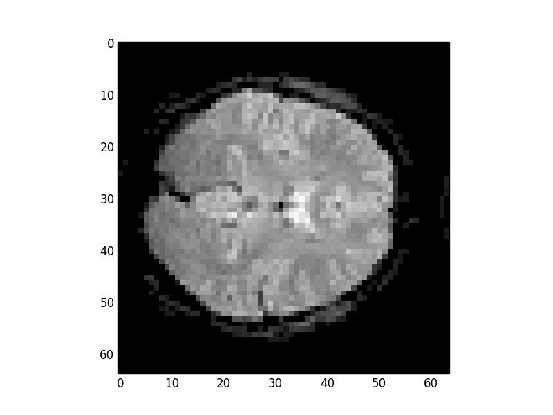

% Analysis Report
% Jon Jara, Juan Shishido, Paul Wu, Wendy Xu
% November 12, 2015

# Introduction

## The Paper

The Neural Basis of Loss Aversion in Decision-Making Under Risk

Authors: Tom, Fox, Trepel, and Poldrak (2007)

Idea:

> We investigated neural correlates of loss aversion while individuals decided
whether to accept or reject gambles that offered a 50/50 change of gaining or
losing money.

## The Data

- 16 subjects are presented with a gamble with gain and loss values and asked whether they will take the gamble or not. 
- Subject has behavorial data that corresponds with each gamble + a binary varaible indicating whether the took the gamble or not. 
- Each subject also has a bold.nii with an fMRI image along time courses while the experiment was being conducted 
	- Challenge: combine the behvaorial data (with gain and loss values) and the fMRI image data for modeling purposes. 

## methods of Analysis

- Linear Regression
	
- MVPA (Multi-voxel pattern analysis)

## Linear Regression Description 
- Creating a meaningful design matrix for linear regression 
   		- including size of gain,loss, and a convolved regressor
	- Applying a linear model on each voxel 
	- incorporating *every* subject and *every* run (by averaging)
	- Plotting 
	- Final Goal: Use plots of beta coefficients to find areas of the brain sensitive to loss and gains
		- Are they the same? Are they oppisites?

## Basics

- downloaded data
    - created a `bash` script included in `Makefile`
- convolution
    - gamma for hemodynamic
    - non-constant repetition time for neural model
- regression
- RMS

## Example Plot

# Plan

## Statistical Analyses

- linear regression
- multi-pattern voxel analysis

## Regression

## Multi-Pattern Voxel Analysis

Used for estimating the whole brain.

Norman, Polyn, Detre, and Haxby (2006)

## Tools

- NumPy
- Nibabel
- Statsmodels
- Scikit-Learn
- Nilearn
- PyMVPA
- Matplotlib
- Seaborn

# Process

## Most Difficult Part

- defining and scoping an analysis plan
    - data approaches
    - analyses methods
- Git workflow
    - coordination
