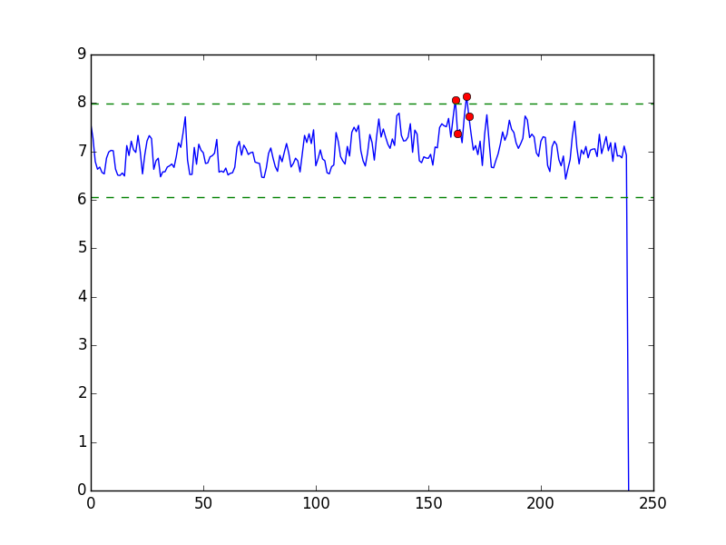
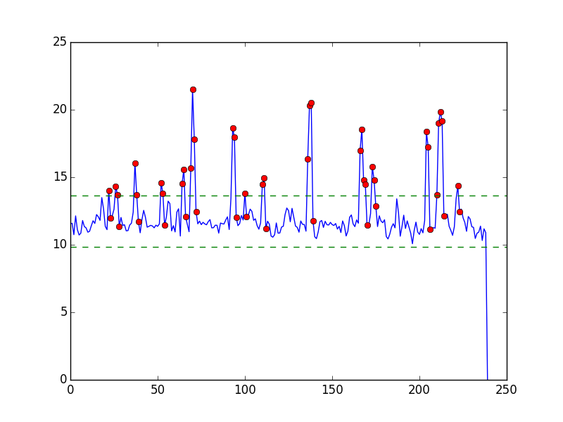
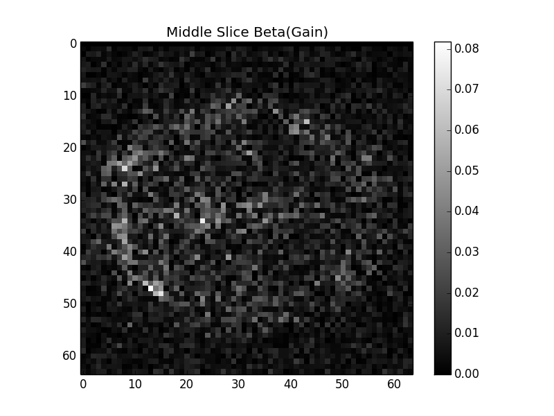
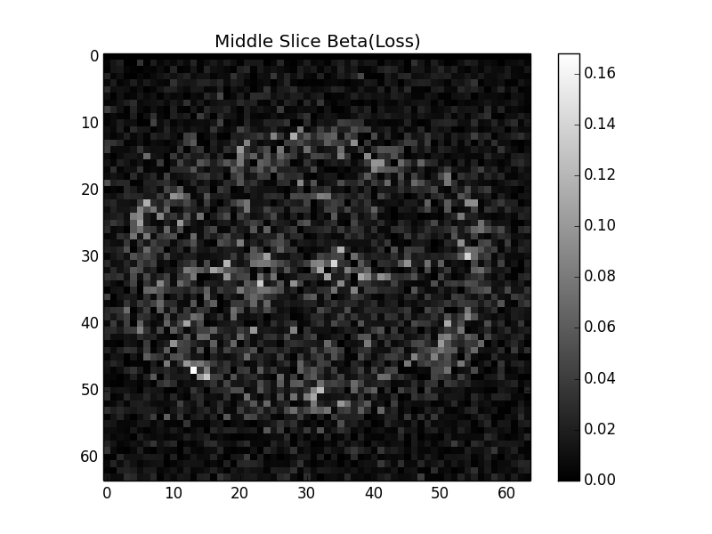
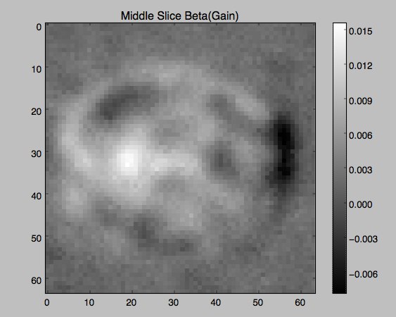
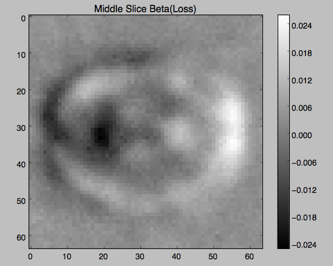
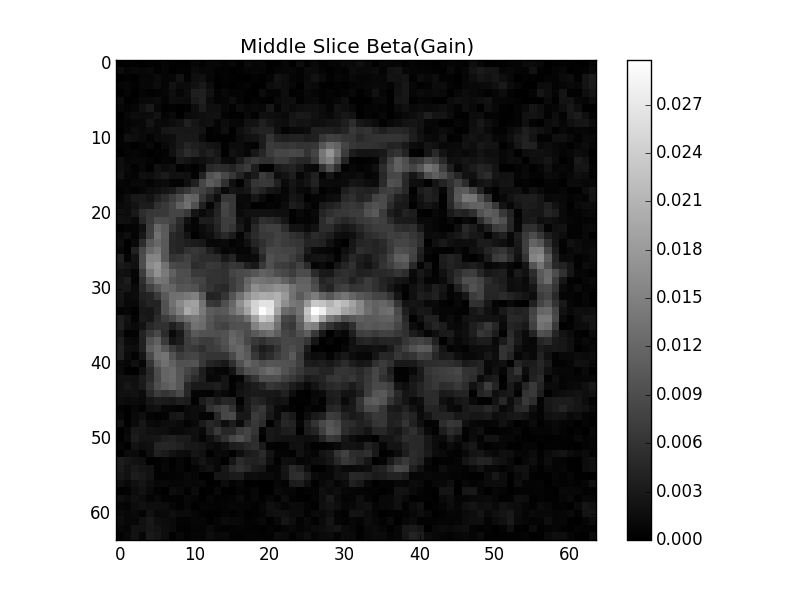
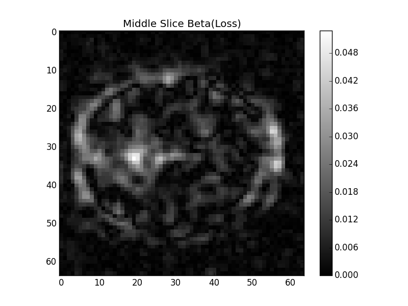
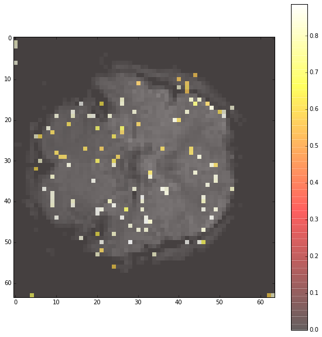
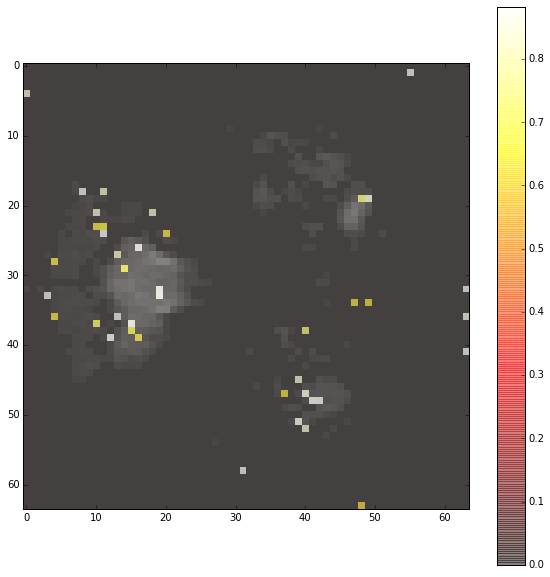

% Analysis Report
% Jon Miguel Jara, Juan Shishido, Paul Wu, Wendy Xu
% December 3rd, 2015

# Introduction

## The Paper

The Neural Basis of Loss Aversion in Decision-Making Under Risk

Authors: Tom, Fox, Trepel, and Poldrak (2007)

Idea:

> We investigated neural correlates of loss aversion while individuals decided
whether to accept or reject gambles that offered a 50/50 change of gaining or
losing money.

## The Data

- 16 subjects are presented with a gamble with gain and loss values and asked whether they will take the gamble or not. 
- Subject has behavorial data that corresponds with each gamble + a binary varaible indicating whether the took the gamble or not. 
- Each subject also has a bold.nii with an fMRI image along time courses while the experiment was being conducted 
	- Challenge: combine the behvaorial data (with gain and loss values) and the fMRI image data for modeling purposes. 

## methods of Analysis

- Linear Regression
	
- MVPA (Multi-voxel pattern analysis)

## Linear Regression Description 
- Writing pre-proccessing functions 
	- Outliers 
	- Smoothing
- Creating a meaningful design matrix for linear regression 
   	- including size of gain,loss, and a convolved regressor
- Applying a linear model on each voxel
- incorporating *every* subject and *every* run (by averaging)
- Plotting 
- Final Goal: Use plots of beta coefficients to find areas of the brain sensitive to loss and gains
	- Are they the same? Are they oppisites?

## Pre-Proccessing  
- Used RMS vector method for removing outlying volumes before analysis 
	- some subjects/runs had 0 outlying volumes while some had as much as 40+
- Used Gaussian Filter by 2 SD's in all 3 spatial dimensions 

## sub001/run001	

## sub009/run003

## Created a design matrix for regression
- Created 4 by 240 (number of volumes) design matrix for each subject that had columns for loss, gain, and a convolved regressor 

> Regressors of interest were created by convolving a delta function representing trial onset times with a
canonical (double-gamma) hemodynamic response function.

## Applying the model and aggregating data 

- Aggregation 
	- Instead of observing only 1 subject, we applied our linear model to every:
		- Run (averaged betas for every run for each subject)
		- Subject (averaged betas for every subject in the study)
	- Result: "average" volumes for gain and loss coefficients for analysis 
- Back to our question: Which parts of the brain are most sensitive to gains and losses? Are they the same 

	

# Brain Images

## Before Smoothing

## Before Smoothing

## After Smoothing 

## After Smoothing 

## Absolute values 

## Absolute values 

# Multi-Pattern Voxel Analysis

## Multi-Pattern Voxel Analysis

- "searchlight"  process runs the classification algorithm for (almost) all cubes across the entire brain.
	- Used find regions of interest (ROI) in the brain contain the signals we're interested in
- Cross-validation is used for classification 
	- also known as, "Leave Block Out." 
- Once we have our classification accuracy scores, we assign those to the cube centers.

## Goal of MVPA

> If this performance of the classifier is significantly above chance, one concludes that the BOLD responses contain information about the classified states, and infers that the brain area where the signals originated is somehow involved in the neural representation of these states" (Kai Schreiber and Bart Krekelberg).

# MVPA plots

## MVPA

## MVPA

